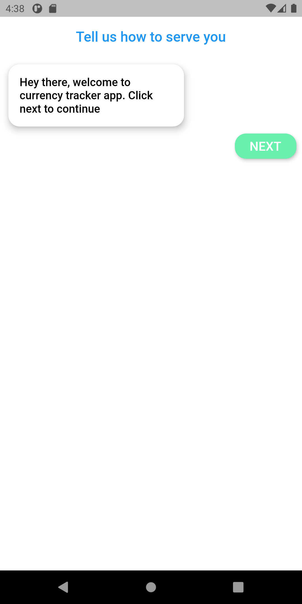
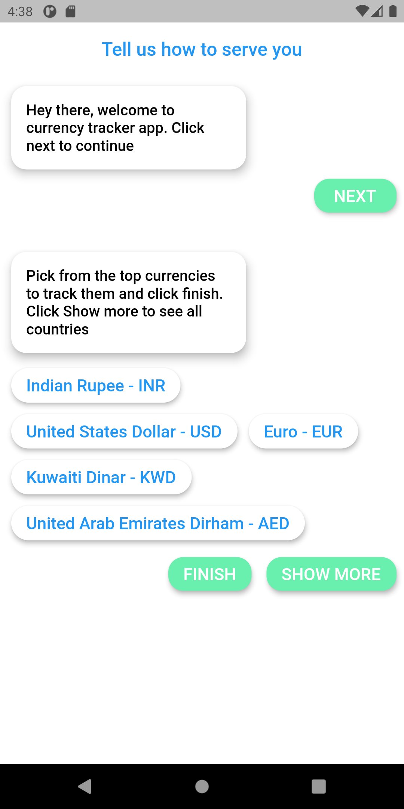
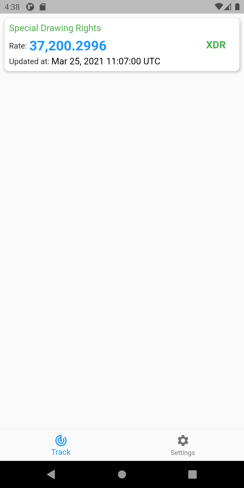
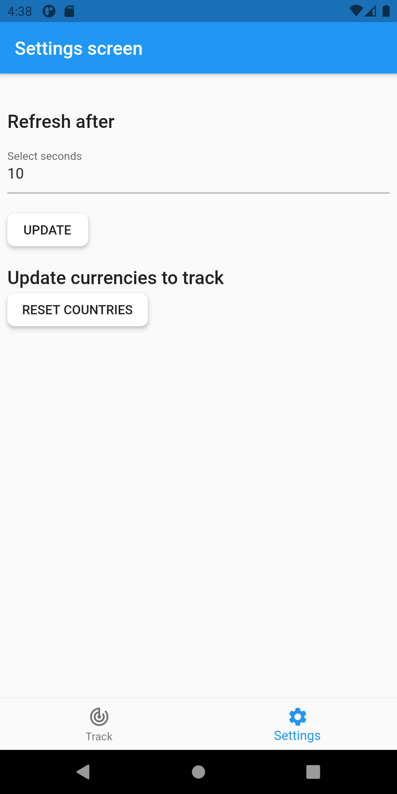

# currency_tracker

An application that uses [Coindesk API](https://api.coindesk.com/v1/bpi) to track the currency rates.
Automatically refreshes the selected currency rates after specified number of seconds.

### Screenshots
---
   